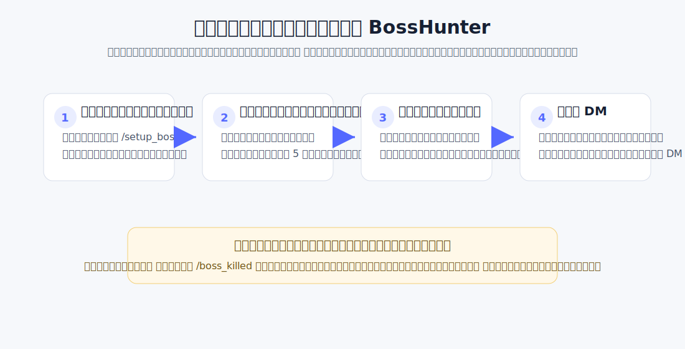
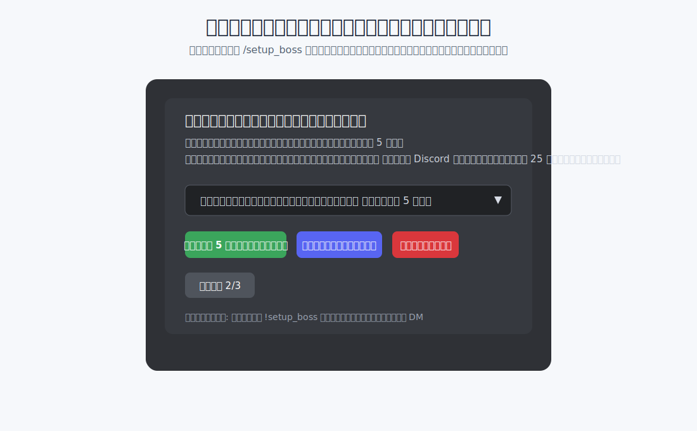
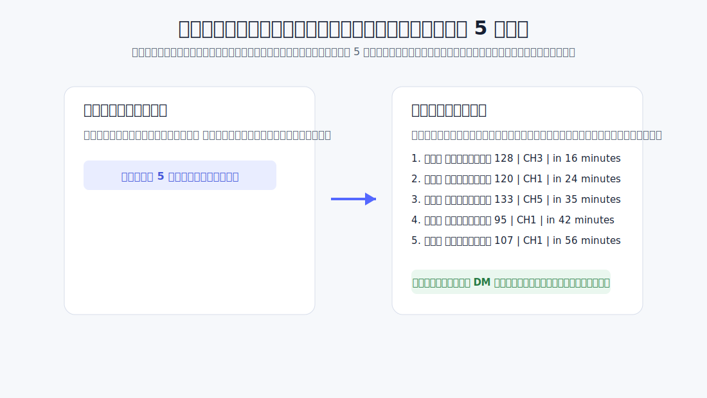
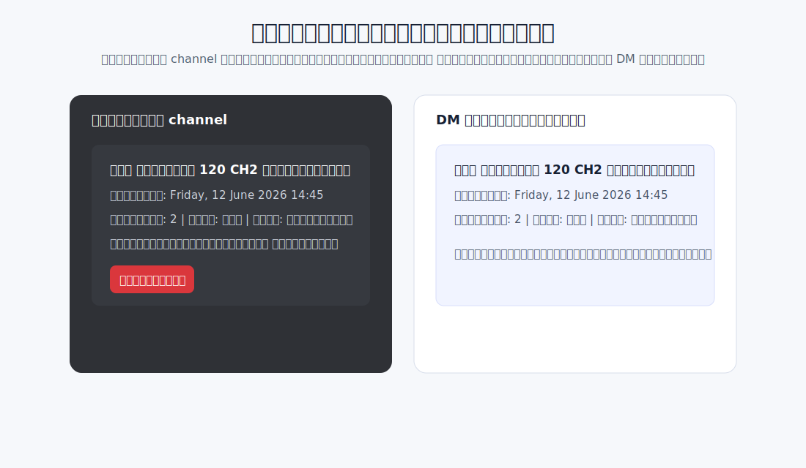
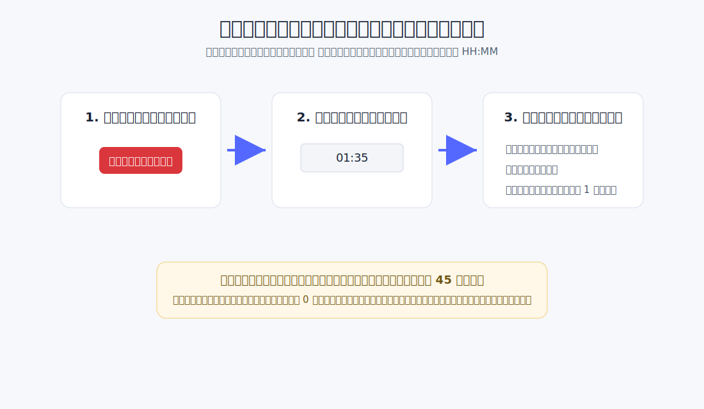
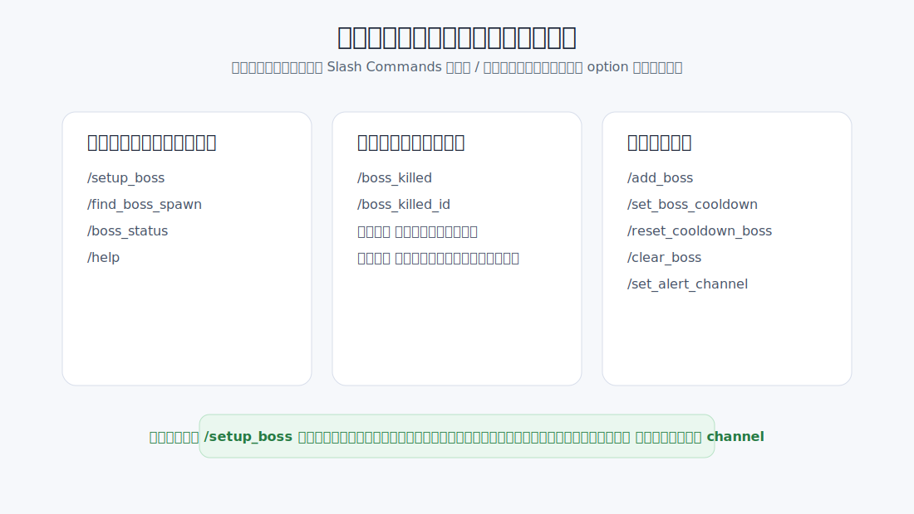

# คู่มือการใช้งาน BossHunter Discord Bot

คู่มือนี้สำหรับสมาชิก Discord ที่ต้องการติดตามเวลาบอสเกิด จัดกลุ่มเป้าหมายล่าบอส และบันทึกเวลาคูลดาวน์ให้ระบบแจ้งเตือนรอบถัดไปได้ถูกต้อง

> ภาพประกอบในคู่มือนี้เป็นภาพจำลองหน้าจอ เพื่ออธิบายตำแหน่งปุ่มและลำดับการใช้งาน



## เริ่มต้นใช้งาน

ใช้คำสั่งนี้ใน Discord:

```text
/setup_boss
```

ระบบจะแสดงแผง `จัดกลุ่มเป้าหมายล่าบอส` แบบส่วนตัว เฉพาะคนที่ใช้คำสั่งเท่านั้น สมาชิกคนอื่นจะไม่เห็นแผงของเรา

ถ้าใช้คำสั่งแบบพิมพ์:

```text
!setup_boss
```

บอทจะส่งแผงจัดกลุ่มไปทาง DM ของคนพิมพ์แทน



## จัดกลุ่มเป้าหมายล่าบอส

สมาชิก 1 คนสามารถเพิ่มบอสเข้ากลุ่มส่วนตัวได้สูงสุด 5 ตัว กลุ่มนี้ใช้สำหรับรับ DM เมื่อบอสในกลุ่มเริ่มเข้าเฟส

วิธีเพิ่มบอสเข้ากลุ่ม:

1. ใช้ `/setup_boss`
2. เปิดเมนูเลือกบอส
3. เลือกบอสที่ต้องการติดตาม
4. ระบบจะบันทึกเข้ากลุ่มของเราแบบส่วนตัว

ถ้ารายชื่อบอสมีมากกว่า 25 ตัว ระบบจะแบ่งหน้า เพราะ Discord จำกัด select menu ไว้ที่ 25 รายการต่อเมนู ใช้ปุ่ม `หน้า .../...` เพื่อเปลี่ยนหน้า

## เพิ่ม 5 ตัวที่ใกล้เกิดที่สุด

ในแผงจัดกลุ่มมีปุ่ม:

```text
เพิ่ม 5 ตัวใกล้เกิด
```

เมื่อกดปุ่มนี้ ระบบจะตั้งกลุ่มของเราเป็นบอส 5 ตัวที่มีเวลาเกิดใกล้ที่สุดทันที เหมาะสำหรับสมาชิกที่อยากตามล่าตัวที่กำลังจะเกิดเร็ว ๆ โดยไม่ต้องเลือกเองทีละตัว



## ดูหรือล้างกลุ่มของเรา

ในแผงจัดกลุ่มมีปุ่มสำคัญ:

- `ดูกลุ่มของฉัน`: แสดงรายชื่อบอสที่เราเลือกไว้
- `ล้างกลุ่ม`: ล้างบอสทั้งหมดออกจากกลุ่มของเรา

การกดปุ่มเหล่านี้จะแสดงผลแบบส่วนตัว ไม่รบกวน channel

## การแจ้งเตือนบอสเกิด

เมื่อบอสเริ่มเข้าเฟส ระบบจะแจ้งใน channel หลัก และถ้าบอสนั้นอยู่ในกลุ่มของสมาชิกคนใด ระบบจะส่ง DM ไปหาเจ้าของกลุ่มคนนั้นด้วย

ตัวอย่างข้อความใน channel:

```text
บอส แมพเลเวล 120 CH2 เริ่มเข้าเฟส
เวลาเกิด: Friday, 12 June 2026 14:45
ช่องเกิด: 2 | ธาตุ: น้ำ | เผ่า: กลายพันธุ์
กดปุ่มบันทึกเวลาคูลดาวน์ หลังบอสตาย
```



## บันทึกเวลาหลังบอสตาย

หลังบอสตาย ให้กดปุ่ม `บันทึกเวลา` ในข้อความแจ้งเตือนบอสเกิด แล้วกรอกเวลาคูลดาวน์รูปแบบ `HH:MM`

ตัวอย่าง:

```text
01:35
```

หมายถึง 1 ชั่วโมง 35 นาที

ตัวอย่างเวลาอื่น:

- `00:45` = 45 นาที
- `02:00` = 2 ชั่วโมง
- `00:06` = 6 นาที

หลังบันทึกสำเร็จ ระบบจะ:

- คำนวณเวลาเกิดรอบถัดไป
- แสดงผู้บันทึก
- ปิดปุ่มเพื่อกันกดซ้ำ
- เพิ่มข้อความว่า `ข้อความนี้กำลังจะถูกลบในอีก 1 นาที`
- ลบข้อความแจ้งเตือนนั้นหลัง 1 นาที



## ถ้าบอสไม่มีค่าคูลดาวน์

ถ้าบอสตัวใดมีค่า `cooldown_minutes = 0` ระบบจะส่งข้อความเตือนให้ตั้งค่าคูลดาวน์ พร้อมปุ่ม:

```text
ตั้งค่าคูลดาวน์
```

เมื่อกดแล้วให้กรอกเวลาแบบ `HH:MM` หลังตั้งค่าสำเร็จ ระบบจะปิดปุ่มบนข้อความเดิม แสดงข้อความว่าจะถูกลบในอีก 1 นาที และลบข้อความนั้นอัตโนมัติ

## ดูบอสที่ใกล้เกิดที่สุด

ใช้คำสั่ง:

```text
/find_boss_spawn
```

ระบบจะแสดงบอสที่ใกล้เวลาเกิดที่สุด 5 ตัว เรียงจากตัวที่ใกล้เกิดที่สุดก่อน

ตัวอย่าง:

```text
1. บอส แมพเลเวล 128 | CH3 | เวลาเกิด: Friday, 12 June 2026 18:14 (in 16 minutes)
```

## ดูสถานะบอสทั้งหมด

ใช้คำสั่ง:

```text
/boss_status
```

หรือระบุหน้า:

```text
/boss_status page:2
```

ระบบจะแสดงตารางสถานะบอส เช่น เวลาที่บันทึก ช่องเกิด ธาตุ เผ่า และคูลดาวน์

## คำสั่งที่ใช้บ่อย



### สมาชิกทั่วไป

```text
/setup_boss
/find_boss_spawn
/boss_status
/help
```

### คนที่ช่วยบันทึกเวลา

```text
/boss_killed
/boss_killed_id boss_id:boss_lv80_ch1
```

หรือกดปุ่ม `บันทึกเวลา` ในข้อความแจ้งเตือนบอสเกิด

### แอดมินหรือคนดูแลข้อมูลบอส

```text
/add_boss
/set_boss_cooldown
/reset_cooldown_boss
/clear_boss
/set_alert_channel
```

## ข้อควรรู้

- แนะนำให้ใช้คำสั่งแบบ `/` เพราะ Discord จะแสดงช่องกรอก option ให้ชัดเจน
- ถ้าไม่ได้รับ DM ให้ตรวจว่าเปิดรับข้อความส่วนตัวจากสมาชิกในเซิร์ฟเวอร์ไว้หรือไม่
- แผง `/setup_boss` เป็นของส่วนตัว สมาชิกคนอื่นจะไม่เห็นกลุ่มของเรา
- กลุ่มเป้าหมายล่าบอสจำกัดที่ 5 ตัวต่อสมาชิก
- ถ้ากดปุ่มบนข้อความเก่ามาก ๆ แล้วใช้งานไม่ได้ ให้เปิดแผงใหม่ด้วย `/setup_boss`

## สรุปขั้นตอนเร็ว

1. ใช้ `/setup_boss`
2. เลือกบอสเข้ากลุ่ม หรือกด `เพิ่ม 5 ตัวใกล้เกิด`
3. รอ DM เมื่อบอสในกลุ่มเริ่มเข้าเฟส
4. หลังบอสตาย กด `บันทึกเวลา`
5. กรอกคูลดาวน์แบบ `HH:MM`
6. ระบบคำนวณรอบถัดไปและแจ้งเตือนอัตโนมัติ
